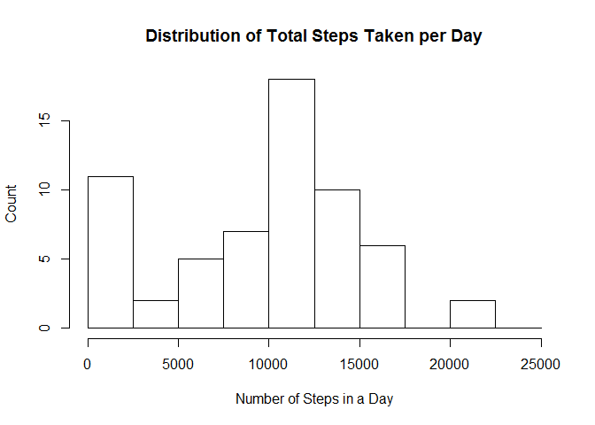
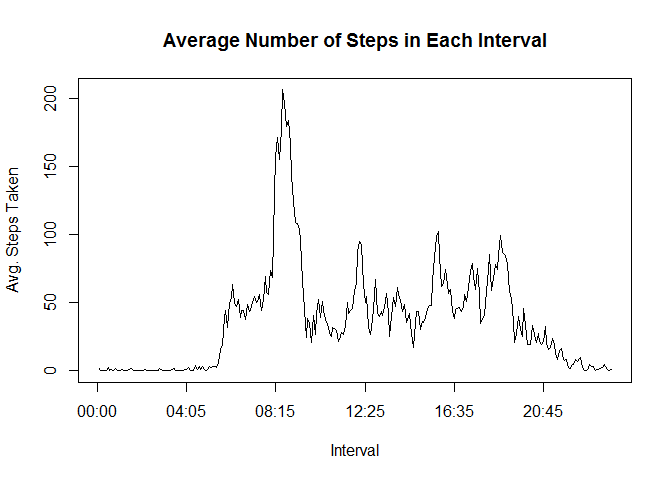
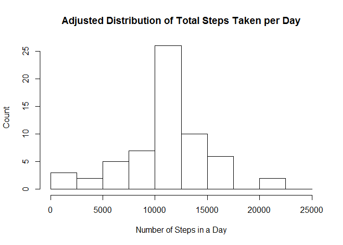
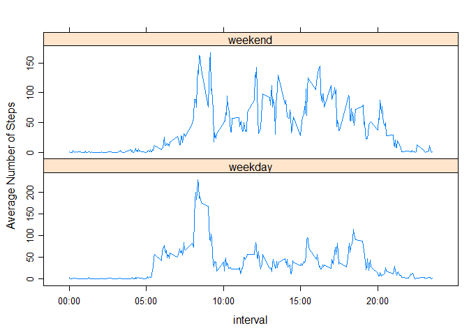

# Peer Assessment 1
Abirvab Deb  
Friday, August 15, 2014  


***
##Loading and preprocessing
#####Loading data into a data frame

```r
con <- file("activity.csv","r")
data <- read.csv(con, header=TRUE)
close(con)
```
***
##What is the mean total number of steps taken per day? 
####Computing the number of intervals recorded each day
The **while loop** in this code chunk iterates until interval 0 is reached again and *count* keeps track of all the intervals.

```r
count=2
num=data$interval[count]
while(num != data$interval[1]){
        count=count+1
        num=data$interval[count]
}
count=count-1
```


####Computing the total number of steps taken per day
Using a *for loop* in this code chunk to iterate through the data frame and summing cumulative steps.

```r
counts=numeric()
n=seq(from=1,to=nrow(data),by=count)
n[nrow(data)/count+1]=nrow(data)+1
for(i in 1:(nrow(data)/count)){
        counts[i]=sum(data$steps[n[i]:(n[i+1]-1)],na.rm=TRUE)
        
}
hist(counts,main="Distribution of Total Steps Taken per Day",xlab="Number of Steps in a Day",ylab="Count",breaks=seq(from=0,to=25000,by=2500))
```

 

```r
mean1=format(mean(counts,na.rm=TRUE),digits=0)
median1=format(median(counts,na.rm=TRUE),digits=0,scientific=FALSE)
```

*The **mean** total number of steps taken per day is **9354**. The **median** total number of steps taken per day is **10395**.*

***

##What is the average daily activity pattern?
The **for loop** in this code chunk iterates through each interval and uses logical indexing to average the steps taken during each interval.  **plot.ts** creates a time series plot of the average activity across all days.

```r
interval=numeric(count)
for(j in 1:count){
        interval[j]=mean(data$steps[data$interval==(data$interval[j])],na.rm=TRUE)
}
plot.ts(interval,main="Average Number of Steps in Each Interval",xlab="Interval",ylab="Avg. Steps Taken",axes=FALSE)
axis(1,at=c(0,50,100,150,200,250),lab=c("00:00","04:05","08:15","12:25","16:35","20:45"))
axis(2)
box()
```

 

####Calculating which 5-minute-interval on average has the maximum number of steps.

```r
m=data$interval[match(max(interval),interval)]
```
*On average, the maximum number of steps is on **5-minute-interval 835**.*

***

##Imputing missing values
####Calculating the number of missing values.

```r
nas=sum(is.na(data$steps))
```
*The number of missing values is **2304**.*

#####The strategy implemented below for imputing missing values is to set the NA values to the mean number of steps for that 5 minute-interval extracted from *interval*.

This code chunk creates a new data frame and replaces NA values with the mean of that 5-minute interval extracted from **interval**.

```r
new_data=data
for(k in 1:length(new_data$steps)){
        if(is.na(new_data$steps[k])==TRUE){
                if(k%%288 == 0){
                        new_data$steps[k]=interval[288]
                }else{
                        new_data$steps[k]=interval[k%%288]
                }
        }
}
```

The **for loop** in this code chunk iterates through the new data frame and adds up all the steps for each interval. A new histogram is plotted with the new data.

```r
for(i in 1:(nrow(data)/count)){
        counts[i]=sum(new_data$steps[n[i]:(n[i+1]-1)])
        
}
hist(counts,main="Adjusted Distribution of Total Steps Taken per Day",xlab="Number of Steps in a Day",ylab="Count",breaks=seq(from=0,to=25000,by=2500))
```

 

```r
mean2=format(mean(counts),digits=0,scientific=FALSE)
median2=format(median(counts),digits=0,scientific=FALSE)
```
*The new mean total number of steps taken per day is **10766**.*  
*The new median total number of steps taken per day is **10766**.*  
The adjusted mean and median with replaced NA values is still similar to the original mean and median, only marginally larger. This makes sense because interval mean values replaced the missing values.

***

##Are there differences in activity patterns between weekdays and weekends?
This code chunk inserts a *Weekday_Weekend* Column in the **new_data** data frame. The **for loop** iterates through **new_data** and marks *weekend* or *weekday* in the new column.

```r
new_data$weekend_weekday=NA
for(j in 1:length(new_data$date)){
        if (weekdays(as.Date(data$date[j])) == "Saturday" | weekdays(as.Date(data$date[j])) == "Sunday"){
                new_data$weekend_weekday[j] = "weekend"
        }else{
                new_data$weekend_weekday[j] = "weekday"
        }
}
```

Casting the *Weekday_Weekend* Column as a factor variable and iterating through **new_data** using logical indexing to compute average steps in weekdays and weekends.

```r
new_data$weekend_weekday=as.factor(new_data$weekend_weekday)

weekend=as.character(new_data$weekend_weekday)=="weekend"
weekday=as.character(new_data$weekend_weekday)=="weekday"
int_wkend=numeric()
int_wkday=numeric()
log_int=logical()

for(j in 1:count){
        log_int=new_data$interval==new_data$interval[j]
        int_wkday[j]=mean(new_data$steps[log_int & weekday])
        int_wkend[j]=mean(new_data$steps[log_int & weekend])
}
```

*plot_data* is a  data frame that holds the weekend and weekday average steps data. The *lattice package* is used to create the final time series plot comparing the weekend and weekday average activity.

```r
plot_data=data.frame(interval=numeric(count),wkend_wkday=numeric(2*count),factors=factor(2*count))
plot_data$interval=new_data$interval[1:count]
plot_data$wkend_wkday=c(int_wkend,int_wkday)
plot_data$factors=c(rep("weekend",times=count),
                    rep(x="weekday",times=count))
plot_data$factors=as.factor(plot_data$factors)

library(lattice)
xyplot(wkend_wkday~interval|factors,data=plot_data,type="l",
       scales=list(x=list(at=c(0,500,1000,1500,2000),
        labels=c("00:00","05:00","10:00","15:00","20:00")),
        y=list(relation="free")),layout=c(1,2),ylab="Average Number of Steps")
```

 
